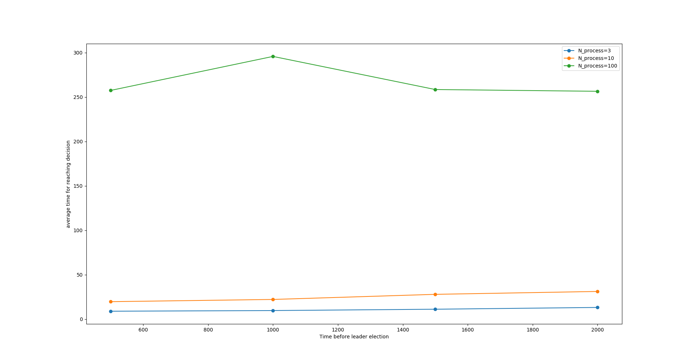

# High-level description

The system consists of a number of processes, communicating with each other to come to an agreement about a value, 0 or 1, using a version of the Paxos protocol.

This protocol works in two main steps:

1. Prepare phase:

- first, a process sends a ballot number to all the other processes, acting as a sort of priority number.

- When a process receives this ballot number, if it has not received a demand with a higher ballot number, it must promise the sender not to accept proposals for demands with smaller ballot numbers. Moreover, if it is about to decide on a value, the receiving process must send the almost decided value to the sender.
If the received ballot is smaller than the ballot the receiver is already committed to, the process sends an abort message so that the sender can restart a proposal with a new ballot number.

2. Accept phase:

- When the proposer receives promises from at least half of the processes, it first determines the value it must propose for acceptation. This value is the one associated to the highest ballot number among the proposal about to be decided. If no such value exists, the proposer proceeds with its own value.

- Upon receiving an accept demand, a process verifies once more that it has not committed to a process with a higher ballot number, or accepted the value with a higher ballot number. In that case, the process sends abort to the sender. Otherwise, the receiver sends back an acknowledgment to the sender.

- Finally, when the proposer receives acknowledgments from at least half the processes, the value is decided, and a decide message is sent to all.

This protocol has the advantage of still being able to produce results even though some processes (no more than half of them) a fault-prone.

\newpage

# Pseudo-code

The JavaDoc of the message classes of the class below gives an overview of our implementation.

``` Java
public class Process extends UntypedAbstractActor {
    // failure config
    private enum State {CORRECT, ERROR_PRONE, SILENT}
    private enum Phase {PREPARE, IMPOSE, DECIDE}
    private State state = State.CORRECT;
    private Phase phase = Phase.PREPARE;
    private double crashProba = 0.01;

    // a proposing process will send proposals until it is not active anymore
    private boolean isActive = true;

    // general purpose random generator
    private Random rdGen = new Random();

    // ballots and estimates config
    private int ballot;
    private int promiseBallot=0;
    private int imposeBallot =0;
    private int estimate=-1;

    // the value proposed by this process
    private int personalValue;
    private int proposedValue=-1;

    private int decidedValue = -1;

    private int nbAck = 0;
    // the states of the responding processes
    private HashMap<ActorRef, PromiseState> promiseStates;

    // the list of processes
    public ArrayList<ActorRef> actors = new ArrayList<>();


    private final LoggingAdapter log = 
							Logging.getLogger(getContext().getSystem(), this);

    public Process(int ballot){
        this.ballot=ballot;
    }


    /**
     * set the process state to silent (emulate crash)
     */
    private void crashProcess(){
        state = State.SILENT;
        log.info("state changed to SILENT");
    }

    /**
     * propose a value to the other processes
     */
    private void propose(){
        // reset the responses
        promiseStates = new HashMap<>();
        phase=Phase.PREPARE;
        nbAck = 0;
        // new ballot number
        ballot += actors.size();
        log.info("Start proposal with ballot number {}", ballot);
        // send the proposal
        for(ActorRef actor: actors){
            actor.tell(new PrepareMessage(ballot), getSelf());
        }
    }

    // Messages types

    /**
     * receive the list of actors
     */
    public static class ActorListMessage{
        ArrayList<ActorRef> data;
        public ActorListMessage(ArrayList<ActorRef> data){
            this.data = data;
        }
    }

    /**
     * Order the process to switch its state to ERROR_PRONE
     * an actor receiving this message will become faulty
     */
    public static class CrashMessage {
        public CrashMessage(){}
    }


    /**
     * pick a value to propose and initiate the first proposal
     */
    public static class LaunchMessage {
        public LaunchMessage(){}
    }

    /**
     * initiates a new proposal with the same value
     */
    public static class ProposeMessage {
        public ProposeMessage() {}
    }

    /**
     * stop the process from proposing
     */
    public static class HoldMessage {
        public HoldMessage(){}
    }

    // Paxos protocol messages

    /**
     * send a message containing the ballot number to prepare the proposal
     */
    public static class PrepareMessage {
        public int ballot;
        public PrepareMessage(int ballot) {
            this.ballot = ballot;
        }
    }

    /**
     * Response to decline the prepare and impose proposals indicating that the
	 * process is already engaged with a process with higher ballot number.
     * Upon receiving this message the process will propose again 
	 * after a little delay to give a chance to other processes 
	 * to have their values accepted
     */
    public static class AbortMessage {
        public int ballot;
        public AbortMessage(int ballot) {
            this.ballot=ballot;
        }
    }

    /**
     * engagement from the process not to promise to the processes with smaller
	 * ballot number
     * upon receiving promises from more than half the processes, 
	 * the proposer proceeds to the impose phase
     */
    public static class PromiseMessage {
        public int ballot;
        public PromiseState state;

        public PromiseMessage(int ballot, PromiseState state) {
            this.ballot = ballot;
            this.state = state;
        }
    }

    /**
     * send the value to be accepted in addition to the ballot number
     * the value corresponds to the one associated to the highest ballot
	 * which reached the impose phase
     * if no such number exists, the value of the process is proposed
     */
    public static class ImposeMessage {
        public int ballot;
        public int proposal;

        public ImposeMessage(int ballot, int proposal) {
            this.ballot = ballot;
            this.proposal = proposal;
        }
    }

    /**
     * acknowledge the reception of the value without conflicting counter proposal
     * Upon receiving acknowledgements from enough processes, the value is decided
     */
    public static class AckMessage {
        public int ballot;

        public AckMessage(int ballot) {
            this.ballot = ballot;
        }
    }


    /**
     * Tell the processes that a value was accepted
     */
    public static class DecideMessage {
        public int value;

        public DecideMessage(int value) {
            this.value = value;
        }
    }

    // props
    public static Props createActor(int ballot) {
        return Props.create(Process.class, () -> new Process(ballot));
    }

    @Override
    public void onReceive(Object message) throws Throwable {
        // actions taken according to state
        if(state == State.SILENT) return;
        if(state == State.ERROR_PRONE){
            if(rdGen.nextFloat() < crashProba) {
                log.info("state changed to SILENT");
                crashProcess();
                return;
            }
        }
        // messages processing
        if (message instanceof CrashMessage) {
            state = State.ERROR_PRONE;
            log.info("state changed to ERROR_PRONE");
        } else if (message instanceof ActorListMessage) {
            ActorListMessage m = (ActorListMessage) message;
            this.actors = m.data;
            this.ballot -= this.actors.size();
            log.info("received list of actors");
        } else if (message instanceof LaunchMessage) {
            personalValue = rdGen.nextInt(2);
            log.info("launched with value {}", personalValue);
            propose();
        } else if (message instanceof HoldMessage) {
            isActive = false;
            log.info("stopped");
        }


        // Paxos protocol messages
        else if (message instanceof PrepareMessage) {
            PrepareMessage m = (PrepareMessage) message;
            ActorRef sender = getSender();
            if (promiseBallot > m.ballot || imposeBallot > m.ballot
					|| phase == Phase.DECIDE){
                sender.tell(new AbortMessage(ballot), getSelf());
                log.info("abort promise for ballot {}", m.ballot);
            } else {
                promiseBallot = m.ballot;
                sender.tell(new PromiseMessage(ballot,
									new PromiseState(imposeBallot, estimate)),
							getSelf());
                log.info("promising to ballot {}", m.ballot);
            }
        } else if (message instanceof PromiseMessage){
            PromiseMessage m = (PromiseMessage) message;
            ActorRef sender = getSender();
            if(promiseStates.containsKey(sender)){
                promiseStates.replace(sender, m.state);
            } else {
                promiseStates.put(sender, m.state);
            }

            if(promiseStates.size() > actors.size()/2 && phase == Phase.PREPARE){
                log.info("enough promises received");
                PromiseState maxEstPromise = promiseStates.entrySet().stream()
                        .max(Comparator.comparing(Map.Entry::getValue))
                        .get().getValue();
                proposedValue = (maxEstPromise.imposeBallot != 0)?
											maxEstPromise.est: personalValue;
                log.info("proceed to impose with value {}", proposedValue);
                phase = Phase.IMPOSE;
                for(ActorRef actor: actors){
                    actor.tell(new ImposeMessage(ballot, proposedValue), getSelf());
                }
            }
        } else if (message instanceof ImposeMessage) {
            ImposeMessage m = (ImposeMessage) message;
            ActorRef sender = getSender();
            if (promiseBallot > m.ballot || imposeBallot > m.ballot
					|| phase == Phase.DECIDE) {
                log.info("abort impose for ballot {}", m.ballot);
                sender.tell(new AbortMessage(ballot), getSelf());
            } else {
                log.info("commit to decision {} for ballot {}", m.proposal, m.ballot);
                imposeBallot = m.ballot;
                estimate = m.proposal;
                sender.tell(new AckMessage(m.ballot), getSelf());
            }
        } else if (message instanceof AckMessage) {
            nbAck += 1;
            if (nbAck >= actors.size()/2 && phase == Phase.IMPOSE){
                log.info("value {} decided", proposedValue);
                phase = Phase.DECIDE;
                for(ActorRef actor: actors){
                    actor.tell(new DecideMessage(proposedValue), getSelf());
                }
            }
        } else if (message instanceof DecideMessage) {
            DecideMessage m = (DecideMessage) message;
            decidedValue = m.value;
            isActive = false;
            log.info("get the decision of {}", decidedValue);
            phase = Phase.DECIDE;
        } else if (message instanceof AbortMessage){
            AbortMessage m = (AbortMessage) message;
            if(m.ballot == ballot) {
                log.info("proposal refused with ballot {}", ballot);
                context().system().scheduler().scheduleOnce(
						Duration.create(10, TimeUnit.MILLISECONDS),
                        getSelf(), new ProposeMessage(),
						context().system().dispatcher(), getSelf());
            }
        } else if (message instanceof ProposeMessage) {
            if(isActive) propose();
        }
    }

    public class PromiseState implements Comparable<PromiseState>{
        public int imposeBallot;
        public int est;

        public PromiseState(int imposeBallot, int est) {
            this.imposeBallot = imposeBallot;
            this.est = est;
        }

        @Override
        public int compareTo(PromiseState state) {
            return this.imposeBallot - state.imposeBallot;
        }
    }
}
```
\newpage

# Proof of correctness

## Validity

__if a value is decided, it was proposed by at least one process :__

trivially true

## Aggreement

__no two process can decide different values :__

Let's assume that two process make different decision. Then we can deduce that :

1. These two precesses have received a __DECIDE__ message, containing two different values.
2. Let p and q be respectively the senders of these messages. Then p and q have received a majority of acknoledgments (i.e. __ACK__ messages) in response of attempts of imposing ballots.
Without loss of generality, let's assume that q has the highest ballot number.
3. If q tried to impose a ballot, it means that it has received __GATHER__ messages from a quorum. This quorum intersects with the quorum with received and acknoledged the __IMPOSE__ messages from p.
Let r be a process in the intersection.
4. There are two possibilities :
	- Either r received first the __READ__ request from q, then the __IMPOSE__ request from p. Then, when r received __READ__ request, it learned q's ballot number which is higher than p's one.
	Then, instead of acknoledging p's __IMPOSE__ request, r would have aborted.
	- Or r received first the __IMPOSE__ request from p, then the __READ__ request from q.
	In that case, while responding to q, r would have learnt it that p has already imposed a value. Then instead of imposing its own value, q would have imposed a more recent one.
	This case is also impossible.

## Obstruction-free termination

__If a process proposes, it eventually decides or aborts.__

When a process p proposes :

1. It sends __READ__ request to all.
2. Since the channels are reliable, every process eventually receive and respond.
3. p eventually receive either responses from a quorum, or aborts.
4. In the first case, it tries to impose a value.
5. It sends an __IMPOSE__ request to everybody, which eentually respond.
6. Eventually, p aborts, or receive acknoledgment from a quorum, then decides.

__If a correct process decides, no process abort indefinitely often.__

If a correct process decides, no other process will decide an other value later (cf previous section).
Then no process can try to impose a ballot with higher ballot number than the accepted one. If it would be the case, this new proposal would be decided.
Thus, the highest value __imposeballot__ kept in the system is the value previously decided. Then each time a process tries to read the system, the already decided ballot will be kept
as the highest knwn ballot, and will eventually be decided again.
No process can abort indefinitely often.

__If there is a time after which a single correct process p proposes a value sufficiently many times, p eventually decides.__

The algorith aborts each time a __READ__ or __IMPOSE__ request is received, but a higher ballot number is known.
In the case where all process stop proposing but one, the ballot number of this process will be increased each time a ballot is proposed. At some point, the ballot number of the proposals 
will be greater than any ballot number previously known by the system. Then the process can no longer abort. It will eventually decide.

# Performance analysis

In order to analyse the performance, we run the program with different parameters and construct the following graph:



On the x axis, is represented the time before the simulated leader election (taking the values 0.5s, 1s, 1.5s, and 2s).

On the y axis, is the average on five runs of the time passed before a value was decided.

The three curves are the cases with 3 processes (1 faulty) in blue, 10 processes (4 faulty) in yellow, and 100 processes (49 faulty) in green.

What can be observed is first that the more actors there is, the longer it takes before reaching agreement. And that the time taken seems to depend linearly on the number of processes. This is due to the time necessary for the messages broadcasting.

Secondly, we can see that the time taken before agreement hardly depends on the time before the simulated leader election as it occurs generally before. This is due to the little delay added before re-proposing, giving the other proposals a chance to be accepted.
